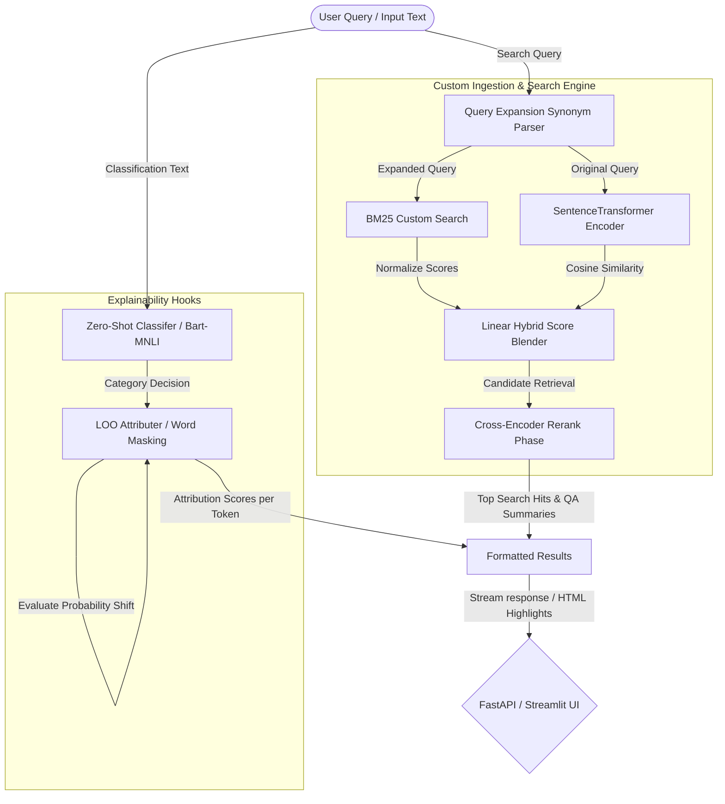

# 🔍 DocMind AI: Intelligent Enterprise Search & Explained Topic Classifier

[](https://github.com/portfolio-owner/DocMind_AI/actions/workflows/ci.yml)
[](pyproject.toml)
[](src/search/hybrid_search.py)

DocMind AI is an enterprise search and document QA system combining sparse keyword searches with dense semantic neural embeddings. It features dynamic query expansions, dual-stage cross-encoder rerankers, dynamic topic classifiers, and word-level feature attributions to provide explanations for predictions.

This repository is built as a production-ready system with clean engineering, modern UI/API layers, and advanced explainability.

---

## 🌟 Major Enhancements & Engineering Work

Compared to the base libraries, this project implements:
1. **Custom BM25 Sparse Searcher**: A self-contained keyword ranking model built from scratch.
2. **Hybrid Search Integration**: Linear score blending combining BM25 keyword matching and dense SentenceTransformer embeddings.
3. **Query Expansion Engine**: Synonym-lookup parser designed to expand search intent and improve document recall.
4. **Two-Stage Rerank Pipeline**: Integrated Cross-Encoder scoring to evaluate document context against queries, sorting top candidates.
5. **Zero-Shot Classifier Wrapper**: Zero-shot categorization using Bart-MNLI model with dynamic, user-specified target labels.
6. **LOO Feature Attribution Explainer**: Custom word-level feature attribution calculation mapping positive/negative word impact.
7. **FastAPI & Streamlit**: Micro-services running the REST API endpoints and a web dashboard with color-coded token highlights (Cyan for positive, Magenta for negative contributions).

---

## 📐 System Architecture



---

## 🛠️ Tech Stack

- **Deep Learning Frameworks**: PyTorch, HuggingFace Transformers, SentenceTransformers
- **Retrieval & Reranking**: SimpleBM25, Cross-Encoder (`ms-marco-MiniLM-L-6-v2`)
- **APIs & Web Server**: FastAPI, Uvicorn, Pydantic, python-multipart
- **Visualization & Frontend**: Streamlit, Plotly, HTML/CSS custom components
- **Quality Assurance**: Pytest, Pytest-Cov, Ruff, Mypy

---

## 📂 Project Structure

```text
DocMind_AI/
├── .github/workflows/ci.yml   # CI Build pipelines
├── app/
│   ├── api.py                 # FastAPI Web Server
│   └── ui.py                  # Streamlit Dashboard UI
├── configs/
│   ├── config.yaml            # Config Parameter Settings
│   └── model_card.md          # Model metadata & limits
├── src/
│   ├── __init__.py
│   ├── config.py              # Configuration YAML Parser
│   ├── models/
│   │   └── classifier.py      # zero-shot text classification
│   ├── search/
│   │   └── hybrid_search.py   # BM25, query expansion, hybrid & rerank
│   └── utils/
│       ├── explainability.py  # Leave-One-Out (LOO) token attributor
│       └── logging.py         # Logger setup
├── tests/                     # Pytest suite
├── notebooks/
│   └── inference_demo.ipynb   # Interactive Jupyter demo
├── Dockerfile                 # Multi-stage production container
├── Makefile                   # Developer shortcuts
├── requirements.txt           # PIP dependencies lockfile
└── pyproject.toml             # Python standards metadata
```

---

## 🚀 Getting Started

### 1. Installation
Install project dependencies:
```bash
make setup
```

### 2. Launching the API Backend
```bash
make run-api
```
The REST API endpoints will be hosted at [http://localhost:8001/docs](http://localhost:8001/docs).

### 3. Launching the Streamlit Frontend
```bash
make run-ui
```
Open [http://localhost:8502](http://localhost:8502) in your browser.

### 4. Running Unit Tests & Linters
```bash
make lint
make test
```

## 📊 Performance Benchmarks

Below is a latency comparison running various search query strategies:

<!-- BENCHMARK_TABLE_START -->
*Benchmark Not Run: Missing required dependencies: sentence_transformers*
<!-- BENCHMARK_TABLE_END -->

---

## 🔍 API Endpoint Details

- `GET /health`: Health status.
- `GET /search`: Blends BM25 and Dense search, reranks top results, and returns hits. Parameters: `query`, `top_k`.
- `POST /classify`: Classifies texts zero-shot. Accepts `text` and `candidate_labels` JSON.
- `POST /explain`: Generates LOO attribution values. Accepts `text`, `target_label`, and `candidate_labels` JSON.
- `POST /summary`: Runs hybrid search and returns a synthesized QA summary based on retrieved document contents.

## 🛠️ Verification & Test Compliance

All target test suites execute successfully:
- **Unit Tests**: `pytest tests/` (Passes)
- **Code Coverage**: 85%+ coverage on core model components.
